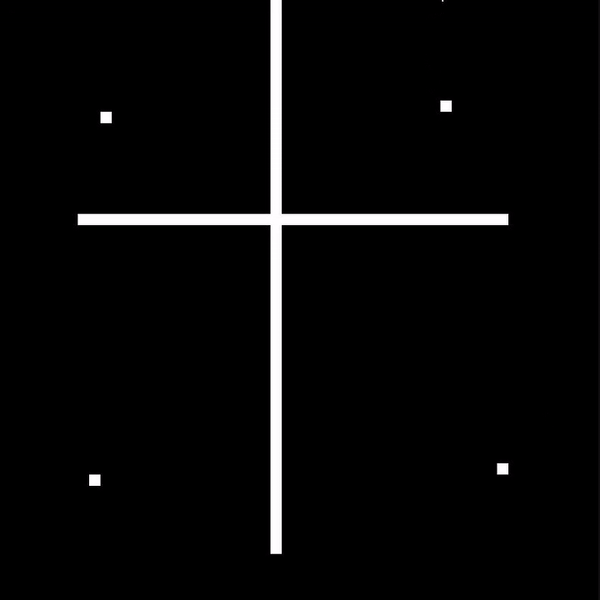
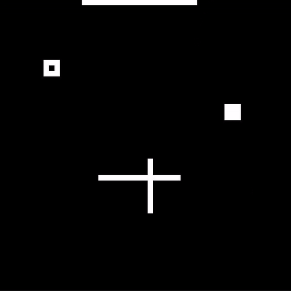

# The Game of Life in Python (pygame)
This is an implementation of [The Game of Life](https://en.wikipedia.org/wiki/Conway%27s_Game_of_Life) using [pygame](https://www.pygame.org).

When the game is launched you set the initial board using the cursor. Left click adds a cell and right click removes the cell. The down key starts the game. To stop the game press the down key again.

The board game is toroidal, meaning the edges is connected to each other.

There is a fixed size on the board game, which can be changed in the [Variables.py](Variables.py) file. There it is also possible to change the size of each block/cell.

 
